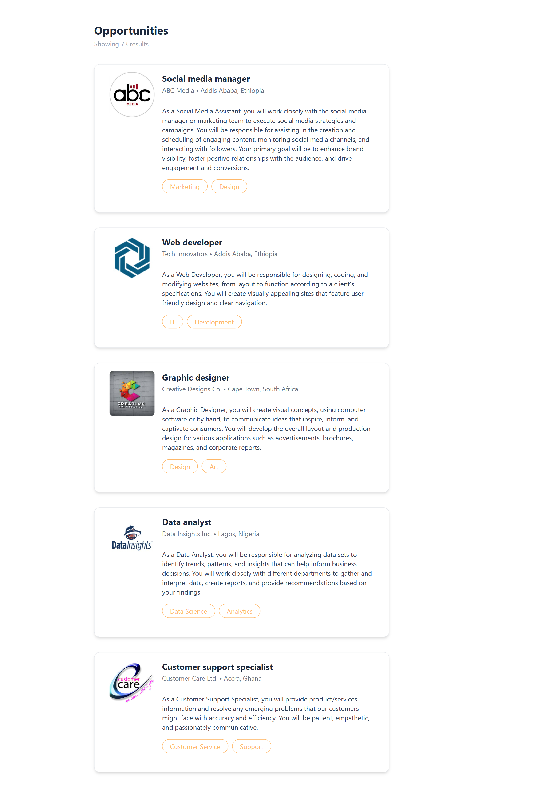
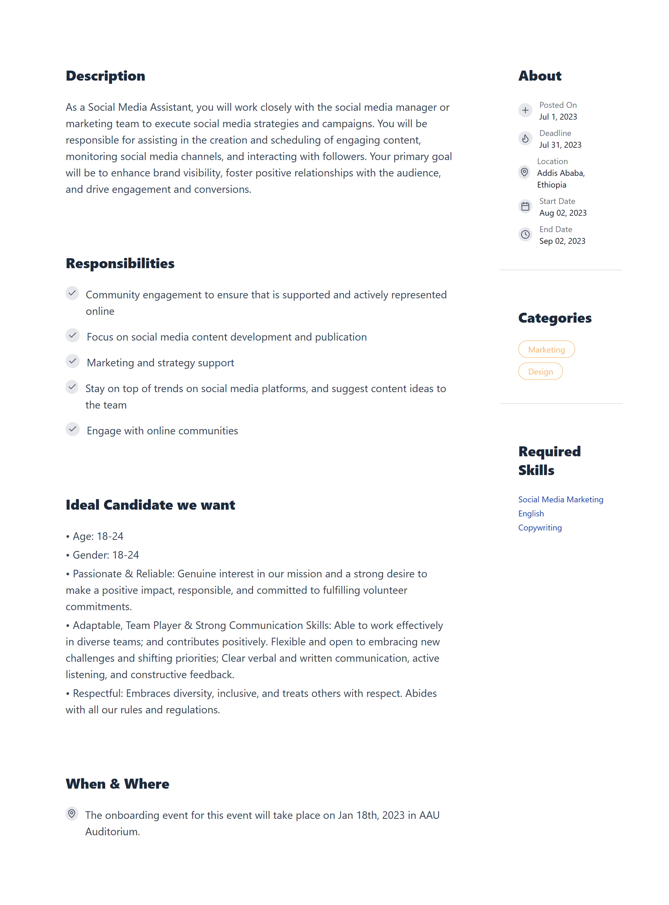

# Job Listing App

## Description

This is a React + Tailwind CSS application for listing jobs. Users can view job cards, click on them, and see detailed dashboards for each job.

## Features

- List all job postings with title, company, location, and categories.
- View detailed dashboard for each job.
- Styled using Tailwind CSS and responsive layouts.

## Technologies Used

- React
- Tailwind CSS
- Vite
- TypeScript

## Usage

- Navigate to / to see the job listings.
- Click on a job card to view the detailed dashboard.

## Screenshots

