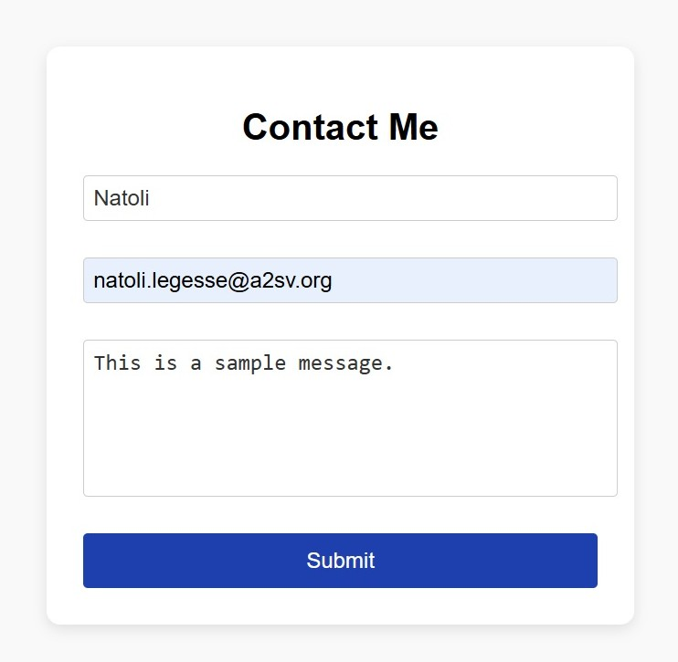
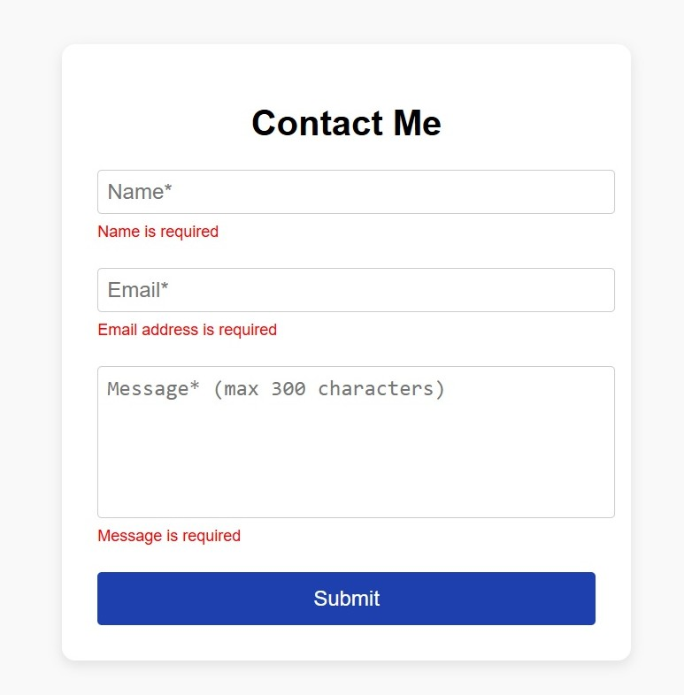

# React Contact Form

A simple, responsive contact form built with **React** using the **react-hook-form** library.  
This project demonstrates form state management, validation, and user-friendly UI design.

---

## **Features**

- Fully functional contact form with:
  - Name (required)
  - Email (required + valid email format)
  - Message (required, max 300 characters)
- Real-time validation with **instant feedback**
- Form submission handling and automatic form reset
- Professional, formal tone UI with a centered card layout
- Responsive design for mobile and desktop screens

---

## **Technologies Used**

- React (Functional Components & Hooks)
- TypeScript
- react-hook-form
- CSS for styling

---

## **Getting Started**

1. **Clone the repository**

```bash
git clone <your-repo-link>
cd <repo-folder>
```

2. **Install dependencies**

```bash
npm install
```

3. **Start the development server**

```bash
npm start
```

The app will run at http://localhost:3000.

## **Usage**

- Fill in the Name, Email, and Message fields
- Validation errors will appear in real-time if fields are empty or invalid.
- Click Submit to send the form.
- Form will reset automatically after submission.

**Screenshots**

### Form view



### Form view with error message


