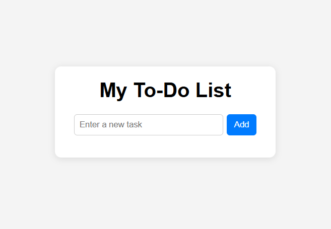
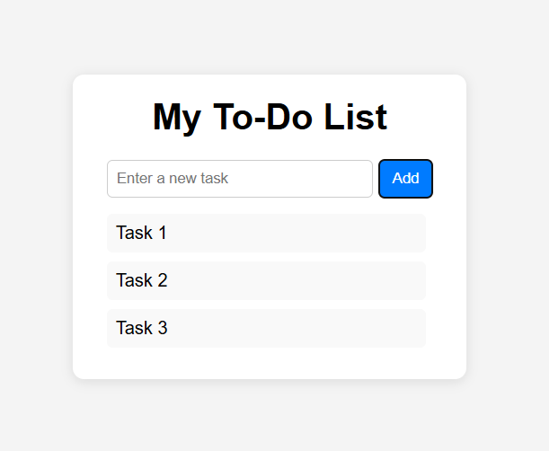

# Simple To-Do List App

## Description

A simple web-based To-Do List app built with HTML, CSS, and JavaScript.
Users can:

- Add tasks
- Remove tasks by clicking on them

## How to Run

1. Open the project folder.
2. Open `index.html` in a web browser (or use Live Server in VS Code).
3. Start adding tasks and manage them dynamically.

## Folder Structure

todo-list/
├── index.html
├── style.css
├── script.js
└── README.md

## Preview

### Before adding tasks

### After adding tasks

