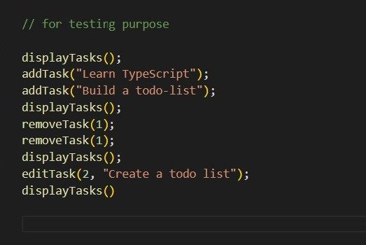
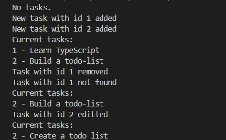

# TypeScript Todo List

This is a simple Todo List application built using **TypeScript**.  
It allows you to **add**, **remove**, **edit**, and **display** tasks in the console.

## Features

- Add a new task with a unique ID
- Remove a task by ID
- Edit a task by ID
- Display all current tasks

## How to Run

1. Make sure you have **Node.js** and **npm** installed.
2. Install TypeScript if you haven't already:
   ```bash
   npm install -g typescript
3. Compile the TypeScript file:
    ```bash
    npx tsc
    
    This will generate todo.js in the same folder (or dist/ if you set outDir in tsconfig.json).

4. Run the compiled JavaScript:
    ```bash
    node todo.js

## Screenshots

## Function Calls


## Console logs

